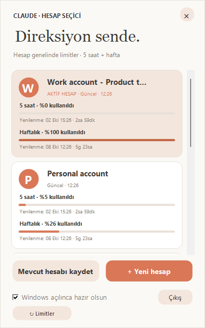
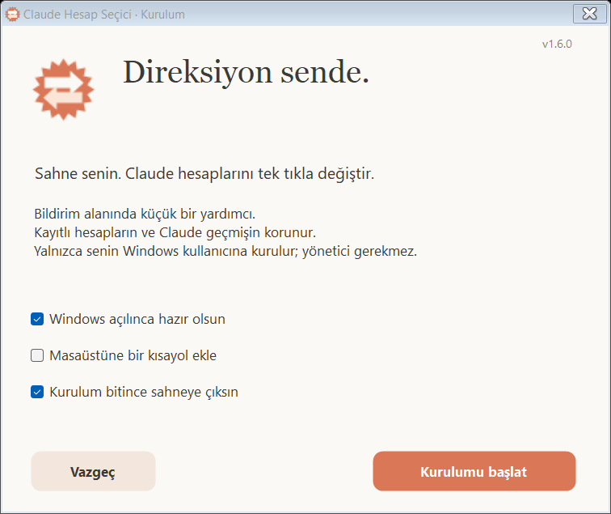
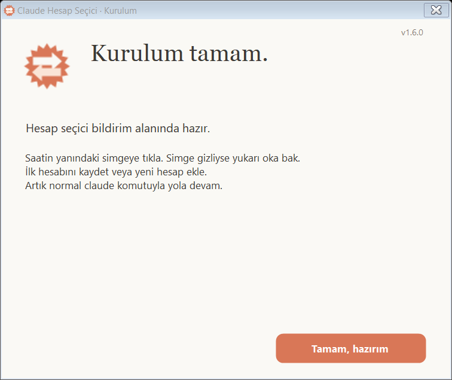
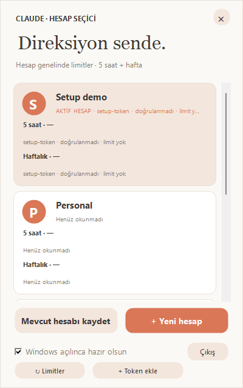
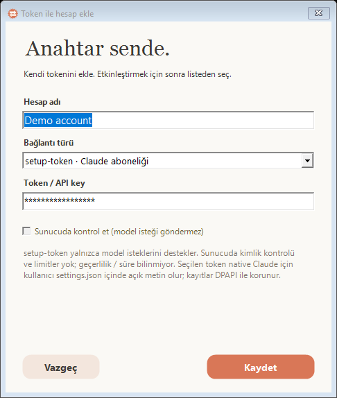
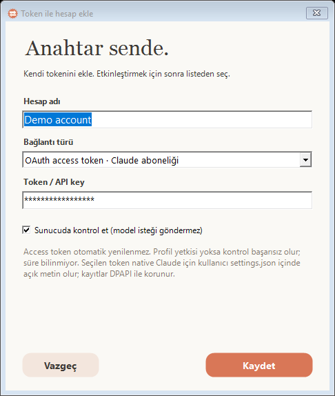
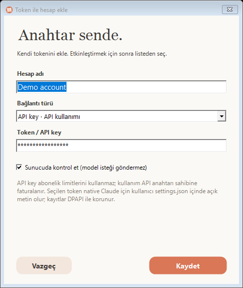
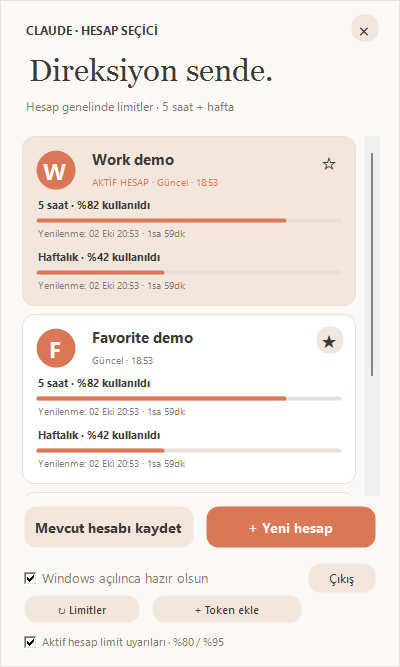

# Claude Code Hesap Seçici — Windows

Claude Code hesaplarını bildirim alanından değiştirin; beş saatlik ve haftalık kullanım limitlerini aynı panelde görün.

[Setup.exe indir](https://github.com/denizataes/claude-account-switcher/releases/latest/download/Claude-Hesap-Setup.exe) · [English documentation](README.md)

Görüntüler demo hesap ve örnek kullanım verisidir; gerçek hesap bilgisi içermez.

1. Setup dosyasını çalıştırın. Yönetici yetkisi gerekmez; Windows başlangıcında açılma, masaüstü kısayolu ve kurulumdan sonra hemen başlatma seçeneklerini seçebilirsiniz. Güncellemeler mevcut kısayol tercihlerini korur.
2. Tray simgesinden **Mevcut hesabı kaydet** ile açık hesabı kaydedin veya **+ Yeni hesap** ile Claude'un normal tarayıcı girişini tamamlayın.
3. Bir hesap kartına tıklayın. Açık Claude oturumları varsa kapatma onayı gösterilir; kaydedilmemiş çalışma kesilebilir. Terminal pencereleri kapatılmaz.
4. Herhangi bir klasörden normal `claude` komutunu çalıştırın. `/status` ile hesabı kontrol edin.

Windows PowerShell 5.1, .NET Framework ve PATH üzerinde Claude Code gerekir. Uygulama arayüzü Türkçedir. Hesap sayısı sabit değildir; her ekip üyesi kendi bilgisayarında kendi hesaplarına girer. Yalnızca kurulum dosyasını paylaşın.

Hassas hesap kayıtları Windows kullanıcısına ait DPAPI ile şifrelenir. Hesap adlarını içeren index şifreli değildir. Kurulum/kaldırma hesap kayıtlarını ve mevcut Claude girişini korur. **Tokenları, credential dosyalarını veya accounts klasörünü GitHub'a yüklemeyin.**

Limit yüzdeleri hesap genelinde **kullanılan** miktarı gösterir. Dahili kullanım endpoint'i sürüme bağlıdır; veri en az beş dakika önbelleğe alınır, 429 durumunda beklenir, eski veri açıkça işaretlenir. Bilinmeyen değer sıfır gibi gösterilmez.

Araç bağımsızdır; resmi Anthropic uygulaması değildir. Claude Code'un dahili Windows oturum formatına bağlıdır; Console ve bulut sağlayıcısı girişleri desteklenmez. Setup dijital olarak imzalı değildir; Windows SmartScreen uyarı gösterebilir.

**1.6 kurulum:** paket önce doğrulanır; bilinen uygulama dosyaları, uygulamaya ait kısayollar ve Windows kaydı yedeklenir. Bildirilen kurulum hatalarında geri alınır; geri alma başarısızsa yedek konumu korunur. Hesap kayıtlarına dokunulmaz. Açık hesap işlemi varken güncelleme başlamaz. Gecikmiş kaldırma yardımcısı yeni kurulumu silemez. Ani sistem kapanmasından sonra kurulumu yeniden çalıştırmak gerekebilir.

Başlangıç artık VBS yerine doğrudan gizli Windows PowerShell kullanır. Uygulama başlangıcı doğrulanamazsa kurulum tamamlanmış olduğu açıkça belirtilir. `%LOCALAPPDATA%\ClaudeAccountSwitcher\setup.log` yalnızca aşama/durum ve zaman bilgisi içerir.

Sessiz kurulum: `Claude-Hesap-Setup.exe /install /quiet`. `/no-launch`, `/startup`, `/no-startup`, `/desktop`, `/no-desktop` seçenekleri desteklenir. Çıkış kodları: **0** başarılı veya başlatma istenmedi; **1** kurulum reddedildi/başarısız; **2** kuruldu, başlangıç doğrulanamadı. Sessiz mod diyalog açmaz.

Testler sahte kullanıcı dosyaları, kullanım verileri ve süreçler kullanır. Gerçek Claude hesabını değiştirmez veya gerçek oturumları kapatmaz. Performans ölçümleri cihaz ve masaüstü yüküne bağlıdır; her ortam için aynı hız veya sıfır hata garantisi verilmez.

Derleme, güvenlik sınırları, kullanım verisinin kaynağı ve testler için [English README](README.md) belgesine bakın.

Aktif hesap panelde her zaman ilk sıradadır. Simgenin üzerine gelince aktif hesap adı ve varsa önbellekteki 5 saatlik kullanım görünür. Harici Claude girişi profili değiştirdiyse panel açılana kadar araç ipucu 'Son bilinen' der; eski kullanım 'eski' olarak işaretlenir. Bu özellik yeni zamanlayıcı veya ağ isteği eklemez.

### Token ile ekleme (1.7)

**1. Token ekle düğmesini açın.** Kayıt eklemek ve hesabı etkinleştirmek ayrı işlemlerdir.

**2. Bağlantı türünü seçin.** Aşağıdaki görüntüler yalnızca sahte, maskeli örnek veri kullanır.

Panelde **Token ekle** seçeneğiyle ad ve token türünü seçip maskeli alana yapıştırın. Kaydetmek hesabı etkinleştirmez; ardından listeden seçin. Tarayıcı girişi korunur.

- **setup-token:** Claude'un `CLAUDE_CODE_OAUTH_TOKEN` yolunu kullanır. Yalnızca biçim kontrolü; doğrulanmadı olarak görünür. Profil/limit bilgisi ve gerçek sona erme süresi yoktur.
- **OAuth access token:** aynı native ortam yolunu kullanır. İsteğe bağlı salt-okunur profil kontrolü kimliği doğrular; model yetkisini kanıtlamaz. Token yenilenmez, refresh token uydurulmaz, süre bilinmiyor. Limitler yalnızca profil doğrulanmış ve servisin desteklediği kayıtlarda okunur.
- **API key:** `ANTHROPIC_API_KEY` yolunu kullanır. İsteğe bağlı Models GET kontrolü model isteği göndermeden yetkiyi kontrol eder. **Kullanım API anahtarı sahibine faturalanır; abonelik limitleri kullanılmaz.**

Kontrol arka planda çalışır, iptal edilebilir; başarısız kontrol kaydetmez. Kontrol kapatılırsa kayıt açıkça doğrulanmadı olarak kalır. Pano otomatik okunmaz, token komut satırına/loglara gönderilmez; testler gerçek kullanıcı tokeniyle model/yenileme isteği göndermez.

Kayıtlar ve `accounts/route.bin` sahiplik kaydı DPAPI ile korunur. **Etkin token, native Claude okuyabilsin diye kendi `.claude/settings.json` dosyanızın `env` alanında açık metindir.** Bu dosyayı ve hesap kayıtlarını paylaşmayın. Araç yalnızca kendi korumalı kaydıyla tam eşleşen anahtar/değeri değiştirir; harici kimlik ayarlarını reddeder. Tarayıcı hesabına geçerken kendi token alanını kaldırır, diğer ayarları korur. Kurtarma günlüğü credential/hesap/owned-env/ledger değişimlerini kapsar. Token kayıtları yerel kayıt kimliği kullanır; hesap UUID'si uydurulmaz.

Performans: metadata damgası artık her okumada yeni `.NET FileInfo` kullanır. Aynı fixture üzerinde 3×100 çağrı medyanı 63,76 ms yerine 17,84 ms; ölçüm yalnızca bu bileşene aittir, tüm uygulama için hızlanma iddiası değildir. Ek boşta çalışan ağ kontrolü/zamanlayıcı yoktur.

### Testler ve ölçüm kapsamı

Windows PowerShell 5.1 ile `Smoke-Test.ps1`, `Tray-Test.ps1`, `Runtime-Test.ps1`, `Token-Test.ps1`, `TokenValidation-Test.ps1`, `TokenUI-Test.ps1`, `Usage-Test.ps1`, `Rendering-Test.ps1`, `Standalone-Test.ps1` ve `Claude-Hesap-Setup.exe /test` çalıştırılır. UI testleri `-STA` gerektirir. Token testleri üç türü, sahiplik çatışmalarını, yazma aşaması hatalarını, kurtarmayı, HTTP sınırlarını ve yavaş sahte kontrolün iptalini doğrular. GitHub CI iptal testini de çalıştırır. Gerçek kullanıcı tokeni veya ücretli model isteği kullanılmaz.

Ölçümler belirli Windows oturumuna ve fixture'a aittir; kusursuzluk ya da tüm cihazlarda aynı hız garantisi değildir. Tam çalıştırma komutları ve güncel boşta CPU/bellek ölçümü [English README](README.md) içindedir.

**1.7.1 ölçümü:** yavaş sahte kontrolün iptali **597 ms** sürdü; yerel testler ve bağımsız tek-EXE kontrolü geçti. Panel kapalıyken 60 saniyelik tek Windows örneğinde CPU zamanı sayaç çözünürlüğünde artmadı; özel bellek **93,65 → 93,57 MB**, handle **638 → 632**, GDI **7 → 7**, USER **10 → 10** oldu. Bu, sıfır CPU tüketimi veya her makinede aynı performans iddiası değildir; gerçek token/model isteği yapılmadı.

12 hesaplı UI fixture: ilk açılış **568,7 ms**, 100 tekrar aç/kapat ortalaması **16,47 ms**, handle farkı **0**, GDI farkı **+2**. 20 yeniden oluşturma/kapatma ve temizliğin ardından GDI **26 → 22** oldu. Tek çalıştırmanın sonucudur; sınırsız süreli sızıntı kanıtı veya gerçek hesap geçişi ölçümü değildir.

### Favoriler ve limit bildirimleri (1.8)

Karttaki **☆ / ★** düğmesi hesabı değiştirmeden favoriyi açar/kapatır; Enter/Space de yalnızca yıldızı çalıştırır. Aktif hesap her zaman ilk, favoriler kayıt sırası korunarak sonraki sıradadır. Hesap seçim numaraları değişmez.

**Aktif hesap limit uyarıları · %80 / %95** yalnızca aktif hesabın 5 saatlik/haftalık dönemlerini izler. Var olan güncel kullanım verisi panel açıldığında veya mevcut kullanım kontrolü tamamlandığında değerlendirilir; yeni zamanlayıcı/ağ isteği/otomatik hesap geçişi yoktur. **Panel kapalı kaldığında sürekli canlı izleme garantisi verilmez.** Windows bildirim ayarları ve mevcut önbellek/bekleme sınırları geçerlidir.

Başlangıçtan sonraki her hesap/dönemin ilk güncel okuması sessiz başlangıç değeridir; eksik/eski startup verisi bildirim yağmuruna yol açmaz. Sonraki %80/%95 eşikleri dönem yenilenme zamanına göre tekilleştirilir ve uygulama yeniden açıldığında tekrar edilmez. %95'e sıçrama tek %95 uyarısı verir. İki dönem birlikte eşik geçerse en yüksek uyarı gösterilir ve ikisi tüketilir. Bilinmeyen aktif hesap, eski/hatalı/eksik veri, desteklenmeyen token ve geçmiş/bilinmeyen yenilenme zamanı uyarı üretmez. Uyarıları yeniden açmak veya zaten yüksek kullanımlı hesaba geçmek geçmiş uyarıları tekrarlamaz.

Favoriler, bildirim tercihi ve sınırlı tekilleştirme kaydı `%LOCALAPPDATA%\ClaudeAccountSwitcher\preferences.json` içindedir. Token içermez; yerel hesap kimlikleri nedeniyle paylaşmayın. Bilinmeyen alanlar korunur; bozuk dosya değiştirilmeden uyarılar kapalı davranır. Kaldırma bu dosyayı ve hesapları korur. `Preference-Test.ps1` ve `FavoriteUI-Test.ps1` sıralama, bağımsız yıldız girdisi ve bildirim kurallarını sahte verilerle sınar.

Kart/liste oluşturma sırasında yerleşim artık toplu yapılır. Üç karşılaştırmalı 12-hesap UI örneğinde 1.7.1 / 1.8 tekrar aç/kapat medyanları **3,28 / 3,42 ms**, ilk açılış **797,31 / 629,82 ms** oldu (aralıklar **612,45–963,53 / 617,50–745,56 ms**). Beş hesaplık tek örnekte ilk açılış **527,88 / 525,46 ms**, tekrar ortalaması **3,43 / 2,95 ms** idi. Her çalıştırmada 100 tekrar ve 20 yeniden oluşturma yapıldı; GDI farkı **0**, handle farkı **+1**, final GDI **26 → 20** idi. Bu cihaz/masaüstü yüküne bağlı örnekler evrensel hız iddiası değildir.
